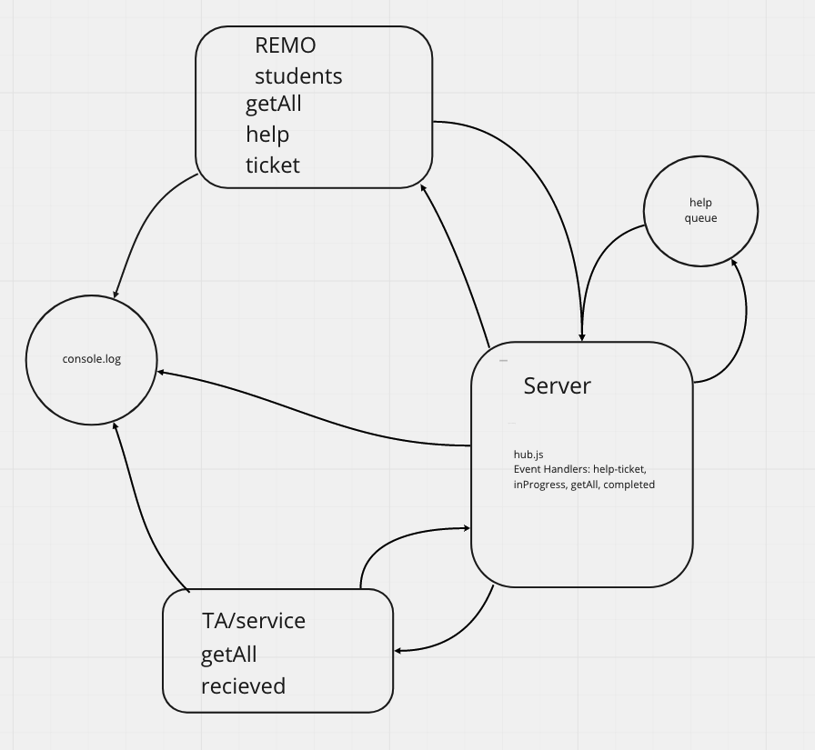

# Support-Service-App
We developed an event driven application that utlizes real time communication and a "queue" to ensure messaging between students and teaching assistants. The app consists of a "hub" server that moderates the events between the student and service clients. Students will submit a request in the form of a help-ticket and the teaching assistant will immediately be notified. The student will be notified that help is on the way. The help session will remain in progress until the help session is completed by the TA. At the conclusion, the TA will be notified thanking them of their help and simultaneously the student will be notified saying have a great day.

## Authors 
Nick Abramowicz
Seid Mohamed

## Dependencies
- Please git init -y on all three folders then npm install dependencies below:
- server folder: faker, socket.io
- service and students folder: faker, socket.io-client

## UML
